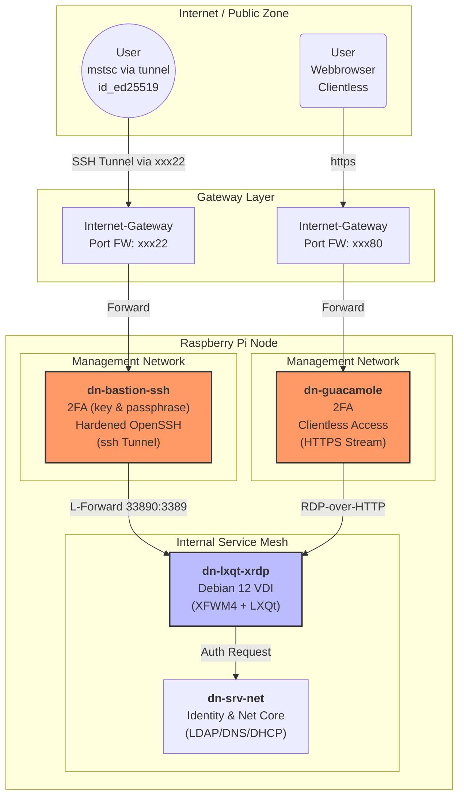

# dn-lxqt-xrdp 
[docker hub](https://hub.docker.com/r/dneuhaus76/dn-lxqt-xrdp)

Debian 12 (bookworm based image with lxqt).
Docker "only" image connect for xrdp (tested on arm64 raspberry pi 4 and amd64 "docker" vm)
Why rdp: I think RDP is not bad and the common denominator (If migrating from other OS where RDP is widespread) - So you have no "Big Bang" pressure if something is not working as desired


## included
### chromium in docker (take notice):
I like chomium but --> maybe with another browser...
https://medium.com/code-and-coffee/running-chromium-in-docker-without-selling-your-soul-433e591802f2
### supervisor (startup manager)
### xrdp (for connection)
### xfwm4 & lxqt

### Apps
- chromium (incl. keepassXC add-in)
  - configured with json-policy-file
- keepassXC (preconfigured for chromium)
- thunderbird
- featherpad,lximage,screengrab,qpdfview,qterminal,qps

### sound
- installed: pipewire-module-xrdp
- need sound-test-command? - **"speaker-test -t sine -f 440 -c 2"**

### local user
- name: **user**
- pw: **user**

## tests
*Warning: some of this "features" are only working by decreased security*
### copy & paste
- source: Windows rdp client --> VDI container
  - copy file to desktop = ok
  - Windows Clipboard to a text file = ok
- source: linux rdesktop --> VDI container 
  - copy file to desktop = no (but you can use the redirection)

### "drive/resource" redirection
* source: Windows rdp client --> VDI container = ok

  
  
* source: linux rdesktop --> VDI container = ok

  

## run
### docker command
quick & dirty "fix" for "chromium sandbox mode" **--cap-add=SYS_ADMIN**
```
docker run -d -p 3389:3389 --cap-add=SYS_ADMIN dneuhaus76/dn-lxqt-xrdp:latest
```
### docker compose
*But cap_add and security_opt like this is vulnerable and for debugging only - maybe switch to another browser like firefox and not use features as gvfs...*
```
services:
  vdi:
    build:
      context: .
    image: dneuhaus76/dn-lxqt-xrdp
    container_name: dn-lxqt-xrdp
    shm_size: '2gb'
    restart: always

    volumes:
      - dn-lxqt-xrdp_home:/home

    cap_add:
      - SYS_ADMIN

    devices:
      - "/dev/fuse:/dev/fuse"

    security_opt:
      #- seccomp=./seccomp.json
      - apparmor:unconfined

    ports:
      - "3389:3389"

    networks:
      - dn-lxqt-xrdp

volumes:
  dn-lxqt-xrdp_home:
    name: "dn-lxqt-xrdp_home"

networks:
  dn-lxqt-xrdp:
    driver: bridge
    name: "dn-lxqt-xrdp"
```

## connect from an rdp-client
example: with sound redirection and current machines user-home into "thinclient_drives" 
```
rdesktop -k de-ch -r sound:local -r disk:"$(hostname)"=/home/${USER} [myserver]
```

## A UseCase - Network-Diagram
This is an example only (but a working example in my lab)...
Here you could either or connect through _(I prefer tunneled RDP, but cuacamole is top for administration work)_
* cuacamole: https (clientless) --> RDP --> VDI
* ssh tunnel: rdpclient --> VDI


